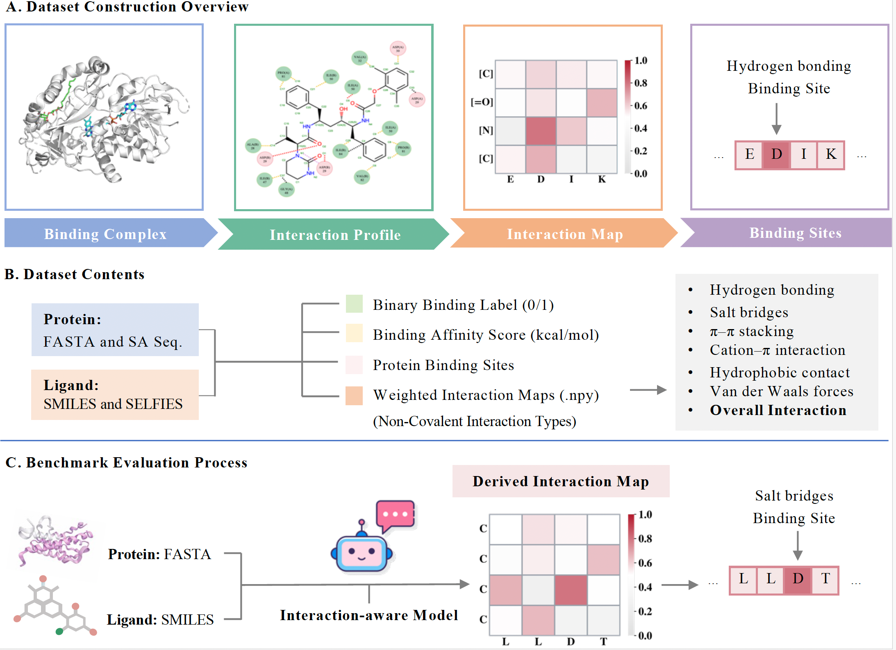

<div align="center">

# InteractBind

<!-- Project Badges -->
[](https://arxiv.org/abs/2605.24045)
[](https://huggingface.co/datasets/Zhaohan-Meng/InteractBind)
[](https://creativecommons.org/licenses/by/4.0/)
[](https://visitorbadge.io/status?path=https%3A%2F%2Fgithub.com%2FZhaohanM%2FInteractBind)

</div>

---

## Overview

InteractBind is a physically grounded protein-ligand interaction dataset and
benchmark for interpretable, interaction-aware binding prediction. It is built
from experimentally resolved protein-ligand complexes and adds fine-grained
supervision beyond binary labels or scalar affinity values.

The dataset is hosted on Hugging Face:
[Zhaohan-Meng/InteractBind](https://huggingface.co/datasets/Zhaohan-Meng/InteractBind).
This GitHub repository provides benchmark usage notes, citation details, and
future code/resources associated with InteractBind.

<div align="center">



<br>
<sub>Dataset construction, annotation contents, and benchmark evaluation workflow.</sub>

</div>

---

## Supported Tasks And Metrics

InteractBind is designed as both a dataset and a benchmark. It supports
traditional protein-ligand outcome prediction while also enabling new
fine-grained tasks that evaluate whether models identify the residue-level
interaction evidence behind binding.

### Traditional Tasks

- **Virtual screening (binary classification):** predict whether a
  protein-ligand pair binds.
- **Binding affinity prediction:** predict the strength of protein-ligand
  binding.

### New-Paradigm: Fine-Grained Evaluation Tasks

- **Binding-site localisation:** identify protein residues involved in ligand
  binding from model-derived interaction signals.
- **Non-covalent interaction-type prediction:** identify binding-site evidence
  by interaction type, including hydrogen bonding, salt bridges, van der Waals
  contacts, hydrophobic contacts, π–π stacking, and cation–π interactions.

**Metric:** `BRHR` (Binding Residue Hit Rate) evaluates whether the top-ranked
model-predicted protein residues overlap with ground-truth binding-site
residues. `BRHR@K` counts a prediction as correct when at least one of the
Top-`K` predicted residues is a true binding-site residue; higher values indicate
better localisation.

> [!NOTE]
> InteractBind is intended to support new evaluation metrics for residue-level localisation, interaction-type correctness, and atom-residue contact fidelity. We welcome new metric designs and will continue updating the benchmark protocol.

---

## Dataset At A Glance

| Item | Description |
| --- | --- |
| Paper | [A Large-Scale Dataset and Benchmark: Do Protein-Ligand Models Learn Binding Sites or Just Binding Likelihood?](https://arxiv.org/abs/2605.24045) |
| Dataset | [Zhaohan-Meng/InteractBind](https://huggingface.co/datasets/Zhaohan-Meng/InteractBind) |
| Scale | 99,391 protein-ligand pairs; 151,895 rows on Hugging Face across released subsets |
| Modalities | Protein sequences, ligand strings, binding labels, affinity values, and interaction maps |
| Format | CSV files with Hugging Face Dataset Viewer support |
| License | [CC BY 4.0](https://creativecommons.org/licenses/by/4.0/) |

## What InteractBind Provides

| Component | Included Fields |
| --- | --- |
| Protein representation | FASTA sequence and structure-aware protein sequence |
| Ligand representation | SMILES and SELFIES |
| Binding supervision | Binary binding label and binding affinity score |
| Fine-grained supervision | Residue-level binding-site fingerprints and non-covalent interaction maps |
| Generalization splits | Protein similarity-controlled OOD subsets: `p_ood_25`, `p_ood_28`, `p_ood_31`, `p_ood_33` |

## Dataset Access

Install the Hugging Face datasets package:

```bash
pip install datasets
```

Load the main affinity subset:

```python
from datasets import load_dataset

dataset = load_dataset("Zhaohan-Meng/InteractBind", "affinity")
print(dataset)
```

Load the protein OOD benchmark subsets:

```python
from datasets import load_dataset

p_ood_25 = load_dataset("Zhaohan-Meng/InteractBind", "p_ood_25")
p_ood_28 = load_dataset("Zhaohan-Meng/InteractBind", "p_ood_28")
p_ood_31 = load_dataset("Zhaohan-Meng/InteractBind", "p_ood_31")
p_ood_33 = load_dataset("Zhaohan-Meng/InteractBind", "p_ood_33")
```

## Interaction Annotations

Each CSV includes seven residue-level binding-site fingerprint columns derived
from non-covalent interaction maps:

| Column | Meaning |
| --- | --- |
| `Hydrogen bonding_binding_site` | Hydrogen-bond binding-site residues |
| `Salt Bridges_binding_site` | Salt-bridge binding-site residues |
| `π–π Stacking_binding_site` | π–π stacking binding-site residues |
| `Cation–π_binding_site` | cation–π binding-site residues |
| `Hydrophobic_binding_site` | Hydrophobic-contact binding-site residues |
| `Van der Waals_binding_site` | Van der Waals contact residues |
| `Overall_binding_site` | Union of supported interaction channels |

Each value is a binary list aligned to the protein FASTA sequence. For example,
`[0,0,1,0]` marks the third residue as a binding-site residue. Negative
protein-ligand pairs without contact-map entries are encoded as all-zero
fingerprints.

## Citation

If you use InteractBind in your research, please cite:

```bibtex
@misc{meng2026largescaleinteractbind,
  title = {A Large-Scale Dataset and Benchmark: Do Protein-Ligand Models Learn Binding Sites or Just Binding Likelihood?},
  author = {Meng, Zhaohan and Bai, Zhen and Yuan, Ke and Ounis, Iadh and Meng, Zaiqiao and Xu, Hao and Loscalzo, Joseph},
  year = {2026},
  eprint = {2605.24045},
  archivePrefix = {arXiv},
  primaryClass = {cs.LG},
  url = {https://arxiv.org/abs/2605.24045}
}
```

## Links

- Paper: [arXiv:2605.24045](https://arxiv.org/abs/2605.24045)
- Dataset: [Zhaohan-Meng/InteractBind](https://huggingface.co/datasets/Zhaohan-Meng/InteractBind)
- Related demo: [Zhaohan-Meng/ExplainBind](https://huggingface.co/spaces/Zhaohan-Meng/ExplainBind)

## License

The Hugging Face dataset is released under the
[CC BY 4.0 license](https://creativecommons.org/licenses/by/4.0/).
